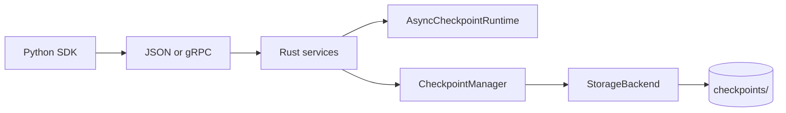

# Faultline

**Fault-tolerant ML checkpointing** — a Rust persistence runtime with a Python SDK for PyTorch-style training loops. Atomic writes, durable metadata, optional async queuing, gRPC transport, and explicit reliability testing.

---

## Highlights (with caveats)

Representative numbers from repo benchmarks on a developer machine. **Your timings will vary** by hardware, payload size, and cold vs warm `cargo run`. See `benchmarks/output/` after re-running scripts.

| Claim | What we measured | Caveat |
|-------|------------------|--------|
| **Slow storage** — sync ~500–550 ms vs async enqueue ~24–40 ms (caller) | `slow_storage_benchmark.py`, `write_delay_ms=500`, 5 saves, ~1 MB pickle | **Caller stall** only; async **time-to-commit** is ~1.5 s+ in the same run (background). Prior runs reported ~526 ms / ~24 ms. |
| **gRPC transport** — file path ~16–28 ms vs inline bytes ~0.7–0.8 ms (caller enqueue) | `grpc_bytes_benchmark.py`, ~4.5 KB pickle (32×32 tensor), release binary, 5 enqueues | Excludes server startup. File path pays temp-file I/O; bytes RPC sends payload inline. |
| **Reliability** — failed writes do not advance latest | `cargo run -- failure-demo` (in-memory + injected failures) | Simulation only; metadata is source of truth. Orphan blobs possible if blob write succeeds but metadata commit fails. |

---

## What this is / is not

**This is:**

- An **ML checkpoint orchestration** layer (save, list, latest, resume, prune)
- A **Rust + Python systems** project (subprocess services, optional gRPC, storage trait)
- **Async persistence** with bounded queue and per-step status
- **Worker-aware metadata** for multi-worker demos
- **Reliability testing** via injectable storage failures

**This is not:**

- A drop-in replacement for `torch.save` on fast local SSD (benchmarks show extra process/protocol cost there)
- A full **distributed training** framework (no ranks, collectives, or shared remote store yet)
- A **production-ready cloud** checkpoint service (no S3, auth, or HA queue yet)

---

## Demo path (for reviewers)

Recommended order (~15–25 minutes):

1. **[PyTorch crash / resume](sdk/examples/pytorch_resume_demo.py)** — `python sdk/examples/pytorch_resume_demo.py` then `--resume`
2. **[Slow storage benchmark](sdk/benchmarks/slow_storage_benchmark.py)** — sync blocking vs async enqueue with simulated delay
3. **[gRPC bytes benchmark](sdk/benchmarks/grpc_bytes_benchmark.py)** — file transport vs inline bytes (build release binary first)
4. **[Worker simulation](sdk/examples/worker_simulation.py)** — 3 workers, crash, resume, per-worker latest
5. **[Failure demo](docs/RUNBOOK.md#5-failure-injection-demo)** — `cd runtime && cargo run -- failure-demo`

Full commands: **[docs/RUNBOOK.md](docs/RUNBOOK.md)**

---

## Quick start

```bash
conda create -n faultline python=3.11 -y
conda activate faultline
pip install torch grpcio   # optional, for demos

cd runtime && cargo test && cd ..
python sdk/examples/basic_usage.py
```

```python
from faultline import AsyncPersistentRuntime

with AsyncPersistentRuntime(runtime_dir="runtime", queue_capacity=8) as rt:
    rt.enqueue_worker_pickle_checkpoint_via_file(0, 1, {"step": 1, "loss": 0.5})
```

Python API details: **[sdk/README.md](sdk/README.md)**

---

## Architecture (short)



Deeper dive: **[docs/ARCHITECTURE.md](docs/ARCHITECTURE.md)**

| Path | Role |
|------|------|
| `runtime/` | Rust: manager, async queue, CLI, gRPC, storage |
| `sdk/` | Python client + examples + benchmarks |
| `proto/` | gRPC schema |
| `docs/` | Architecture, runbook, roadmap |

---

## Documentation

| Doc | Contents |
|-----|----------|
| [docs/RUNBOOK.md](docs/RUNBOOK.md) | Setup, tests, every demo command, cleanup |
| [docs/ARCHITECTURE.md](docs/ARCHITECTURE.md) | Layers, metadata lifecycle, failure semantics |
| [docs/ROADMAP.md](docs/ROADMAP.md) | Done / next / future |
| [sdk/README.md](sdk/README.md) | Python API reference |

---

## Tests

```bash
cd runtime && cargo test
python -m unittest discover sdk/tests
```
