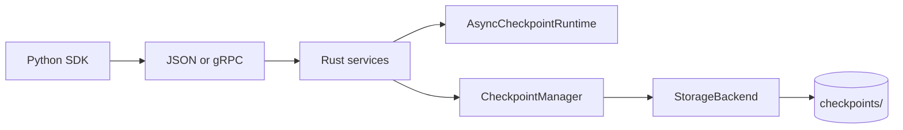

# Faultline

[](#development)
[](#cloud-mode-version-210)
[](#run-the-product-locally-with-docker)

**ML training continuity and recovery platform** — never lose days of GPU training to crashes, preemptions, or cluster evictions. Faultline monitors long-running jobs, stores checkpoints in object storage, and tells you exactly how to resume.

Also includes a Rust persistence runtime for local/PyTorch checkpoint experiments.

---

## Highlights (with caveats)

Representative numbers from repo benchmarks on a developer machine. **Your timings will vary** by hardware, payload size, and cold vs warm `cargo run`. See `benchmarks/output/` after re-running scripts.

| Claim | What we measured | Caveat |
|-------|------------------|--------|
| **Slow storage** — sync ~500–550 ms vs async enqueue ~24–40 ms (caller) | `slow_storage_benchmark.py`, `write_delay_ms=500`, 5 saves, ~1 MB pickle | **Caller stall** only; async **time-to-commit** is ~1.5 s+ in the same run (background). Prior runs reported ~526 ms / ~24 ms. |
| **gRPC transport** — file path ~16–28 ms vs inline bytes ~0.7–0.8 ms (caller enqueue) | `grpc_bytes_benchmark.py`, ~4.5 KB pickle (32×32 tensor), release binary, 5 enqueues | Excludes server startup. File path pays temp-file I/O; bytes RPC sends payload inline. |
| **Reliability** — failed writes do not advance latest | `cargo run -- failure-demo` (in-memory + injected failures) | Simulation only; metadata is source of truth. Orphan blobs possible if blob write succeeds but metadata commit fails. |

---

## What this is / is not

**This is:**

- An **ML checkpoint orchestration** layer (save, list, latest, resume, prune)
- A **Rust + Python systems** project (subprocess services, optional gRPC, storage trait)
- **Async persistence** with bounded queue and per-step status
- **Worker-aware metadata** for multi-worker demos
- **Reliability testing** via injectable storage failures

**This is not:**

- A drop-in replacement for `torch.save` on fast local SSD (benchmarks show extra process/protocol cost there)
- A full **distributed training** framework (no ranks, collectives, or shared remote store yet)
- A **production-ready cloud** checkpoint service (no S3, auth, or HA queue yet)

---

## Demo path (for reviewers)

Recommended order (~15–25 minutes):

1. **[PyTorch crash / resume](sdk/examples/pytorch_resume_demo.py)** — `python sdk/examples/pytorch_resume_demo.py` then `--resume`
2. **[Slow storage benchmark](sdk/benchmarks/slow_storage_benchmark.py)** — sync blocking vs async enqueue with simulated delay
3. **[gRPC bytes benchmark](sdk/benchmarks/grpc_bytes_benchmark.py)** — file transport vs inline bytes (build release binary first)
4. **[Worker simulation](sdk/examples/worker_simulation.py)** — 3 workers, crash, resume, per-worker latest
5. **[Dataset + shard coordination](sdk/examples/dataset_worker_simulation.py)** — register dataset, claim shards, crash, stale release, complete all shards
6. **[Failure demo](docs/RUNBOOK.md#5-failure-injection-demo)** — `cd runtime && cargo run -- failure-demo`

Full commands: **[docs/RUNBOOK.md](docs/RUNBOOK.md)**

---

## Dataset + shard coordination demo

Minimal **dataset registry** for assigning work to workers (local simulation, not multi-node yet):

- Register a dataset with `total_samples` and `shard_size` (shards = ceil(samples / shard_size))
- Workers call `claim_next_shard(worker_id, dataset_name)` and `complete_shard(...)` over gRPC
- `release_stale_shards(timeout_ms)` returns abandoned **Claimed** shards to **Pending** after a worker crash

```bash
conda activate faultline
pip install grpcio grpcio-tools
python sdk/examples/dataset_worker_simulation.py
```

The demo registers `fake-training` (100 samples, 10 per shard → 10 shards), runs 3 workers, simulates worker 1 crashing mid-shard, releases the stale claim, and finishes all shards. Registry state is persisted under `datasets/registry.json` (gitignored).

---

## Faultline Runs API (Version 15.0)

Product-level entry point for training sessions — **runs**, **projects**, and **experiments** — while still using the same checkpoint runtime underneath.

```python
import faultline

run = faultline.init(
    project="protein-model",
    run_name="experiment-1",
    tags=["baseline"],
)

for step in range(1, 101):
    loss = train_one_step()
    run.log_metrics({"loss": loss, "learning_rate": 1e-3}, step=step)
    if step % 10 == 0:
        run.checkpoint({"model": state_dict(), "step": step}, step=step)

run.complete()
```

- Run metadata persists under `runs/registry.json` (gitignored).
- gRPC: `CreateRun`, `ListRuns`, `GetRun`, `UpdateRunMetrics`, `CompleteRun`.
- Dashboard **Runs** section shows active runs, last metric update, latest step/loss, checkpoint step, and a **metric chart** when you select a run (history under `runs/metrics/`).
- Example: `python sdk/examples/pytorch_faultline_run.py` (start `serve-grpc` first).

Low-level worker/shard/checkpoint APIs remain unchanged.

### Monitoring metrics beyond loss (Version 15.2)

Log training progress, step timing, and optional host/GPU telemetry alongside checkpoints:

```python
for step in range(1, 101):
    with run.track_step(step, num_samples=batch_size):
        loss = train_one_step()

    run.log_progress(step, loss=loss, learning_rate=lr)

    if step % 10 == 0:
        run.log_system_metrics(step=step)  # needs: pip install psutil
```

| Method | Logs |
|--------|------|
| `run.log_progress(step, loss=..., learning_rate=..., samples_per_sec=...)` | Training scalars |
| `with run.track_step(step, num_samples=N):` | `step_time_ms`, optional `samples_per_sec` |
| `run.log_system_metrics(step=...)` | `cpu_percent`, `memory_percent`, `process_rss_mb`; GPU MB if CUDA available |

`log_system_metrics` skips quietly when `psutil` is not installed; call `collect_system_metrics()` directly if you want an install hint. The dashboard metric selector plots any logged key (`loss`, `step_time_ms`, `cpu_percent`, `gpu_memory_allocated_mb`, etc.).

### Basic alerts (Version 15.3)

In-memory rules detect stalled jobs, checkpoint failures, and bad metrics (no email/SMS):

| Alert type | Triggers when |
|------------|----------------|
| `checkpoint_failed_or_permanent` | Event log contains `checkpoint_failed` or `checkpoint_failed_permanent` |
| `run_stale` | A **running** run has no metrics for 60s (default) |
| `metric_threshold` | A logged metric crosses a threshold (default: `loss > 10`) |

```python
from faultline import GrpcAsyncRuntime

client = GrpcAsyncRuntime(addr="127.0.0.1:50051", start_server=False)
client.start()
result = client.evaluate_alerts()  # scan runs, metrics, events
print(result["active_count"], result["alerts"])
client.shutdown()
```

Dashboard **Alerts** panel and overview **Active alerts** card refresh every 2s via `EvaluateAlerts`. Example: `python sdk/examples/alert_demo.py`.

---

## Run the product locally with Docker

From the **repo root** (API + Next.js UI + persistent volume):

```bash
docker compose -f docker-compose.cloud.yml up --build
```

| URL | What |
|-----|------|
| http://localhost:3000 | Next.js product UI |
| http://localhost:8080 | FastAPI API |

See **[docs/DEPLOYMENT.md](docs/DEPLOYMENT.md)** for Render, Railway, Fly.io, and Vercel.

---

## Why Faultline exists

Experiment trackers answer *"how did runs compare?"* Faultline answers *"my job died at hour 18 — what step do I restart from, is the checkpoint healthy, and what command relaunches it?"*

## Cloud mode (Version 24.0)

**Not experiment tracking.** Metrics, checkpoints, crash-to-resume, HuggingFace/Lightning callbacks, OAuth browser login, and alerts via **FastAPI + PostgreSQL + MinIO/S3**. v24 adds **Alembic migrations**, **production rate limiting**, and **startup hardening** for controlled beta deploys.

**Deploy:** [docs/PRODUCTION.md](docs/PRODUCTION.md) · **Vercel + Render + Neon + R2:** [docs/DEPLOY_VERCEL_RENDER.md](docs/DEPLOY_VERCEL_RENDER.md) · **Local:** [docs/DEPLOYMENT.md](docs/DEPLOYMENT.md) · **Launch checklist:** [docs/RELEASE_CHECKLIST.md](docs/RELEASE_CHECKLIST.md)

### Install the SDK (customers)

Training runs on **your** machine (laptop, GPU VM, Slurm node, Colab). Faultline Cloud only stores metrics and checkpoints.

```bash
pip install faultline-sdk
export FAULTLINE_API_KEY=fl_...          # from your dashboard → Account
export FAULTLINE_API_URL=https://your-api.example.com
```

```python
import faultline   # PyPI package name is faultline-sdk; import name is faultline

run = faultline.start("my-run", project="demo", api_key=..., base_url=...)
run.log(train_loss=0.5, step=1)
run.save(step=10, model=model, optimizer=optimizer)
run.complete()
```

See **[docs/PYPI.md](docs/PYPI.md)**. The PyPI name `faultline` is used by an unrelated project; we publish as **`faultline-sdk`**.

**Contributors** hacking this repo: `pip install -e sdk` or `PYTHONPATH=sdk` instead of PyPI.

### Two-minute demo (no code)

```bash
docker compose -f docker-compose.cloud.yml up --build
# → http://localhost:3000/demo  (no signup)
# → Log in: demo@faultline.local / faultlinedemo
```

### CLI demo

```bash
set PYTHONPATH=sdk
python -m faultline.cli demo --open
python -m faultline.cli login --email you@example.com --password ...
python -m faultline.cli whoami
```

- **SDK:** `faultline.quickstart()`, `faultline.auto_resume()`, framework callbacks
- **Failure suite:** `PYTHONPATH=sdk python -m faultline.cli demo crash --scenario process_kill_resume`
- **Recovery benchmark:** `PYTHONPATH=sdk python benchmark/recovery/run_benchmark.py`
- **UI:** http://localhost:3000 · **Live demo:** http://localhost:3000/demo
- Legacy dashboard: http://127.0.0.1:8080/dashboard
- Landing: http://127.0.0.1:8080/
- Dev API key: `fl_dev_local` (plaintext, local dev only)
- `faultline.init(..., mode="cloud", api_key="...", base_url="http://127.0.0.1:8080")`

Production: managed Postgres + S3/R2, strong JWT secret, no demo seed. Details: **[docs/PRODUCTION.md](docs/PRODUCTION.md)** and **[cloud/README.md](cloud/README.md)**

---

## Local dashboard (Version 12.1)

Read-only web UI over the same gRPC observability APIs — **FastAPI** backend, static HTML/JS frontend:

```bash
# Terminal 1: Rust runtime
cd runtime && cargo build --release
target/release/runtime.exe serve-grpc --addr 127.0.0.1:50051

# Terminal 2: seed data (optional)
python sdk/examples/observability_usage.py

# Terminal 3: dashboard (from repo root)
pip install fastapi uvicorn grpcio
uvicorn dashboard.app:app --reload
```

Open http://127.0.0.1:8000 — overview cards, worker table, **recent events** timeline, shard table, 2s auto-refresh.

Set `FAULTLINE_GRPC_ADDR` if the runtime listens elsewhere. Details: **[dashboard/README.md](dashboard/README.md)**

---

## Observability APIs

Read-only gRPC inspection — one place for datasets, shards, workers, checkpoints, and async metrics:

```python
overview = runtime.get_runtime_overview()
workers = runtime.list_workers()
shards = runtime.list_shards("fake-training", status="claimed")
```

`GetRuntimeOverview` returns dataset/shard counts, committed checkpoint total, `workers_seen`, and async queue metrics (`total_enqueued`, `total_committed`, etc.). `ListWorkers` merges worker-aware checkpoint metadata with shard claim/completion counts. `ListShards` supports an optional status filter (`pending`, `claimed`, `completed`, `failed`).

```bash
python sdk/examples/observability_usage.py
```

---

## Quick start

```bash
conda create -n faultline python=3.11 -y
conda activate faultline
pip install torch grpcio   # optional, for demos

cd runtime && cargo test && cd ..
python sdk/examples/basic_usage.py
```

```python
from faultline import AsyncPersistentRuntime

with AsyncPersistentRuntime(runtime_dir="runtime", queue_capacity=8) as rt:
    rt.enqueue_worker_pickle_checkpoint_via_file(0, 1, {"step": 1, "loss": 0.5})
```

Python API details: **[sdk/README.md](sdk/README.md)**

---

## Architecture (short)



Deeper dive: **[docs/ARCHITECTURE.md](docs/ARCHITECTURE.md)**

| Path | Role |
|------|------|
| `runtime/` | Rust: manager, async queue, CLI, gRPC, storage |
| `sdk/` | Python client + examples + benchmarks |
| `proto/` | gRPC schema |
| `dashboard/` | Local FastAPI observability UI |
| `docs/` | Architecture, runbook, roadmap |

---

## Documentation

| Doc | Contents |
|-----|----------|
| [docs/RUNBOOK.md](docs/RUNBOOK.md) | Setup, tests, every demo command, cleanup |
| [docs/STORAGE.md](docs/STORAGE.md) | Local, in-memory, failure, and S3/MinIO backends |
| [docs/ARCHITECTURE.md](docs/ARCHITECTURE.md) | Layers, metadata lifecycle, failure semantics |
| [docs/ROADMAP.md](docs/ROADMAP.md) | Done / next / future |
| [sdk/README.md](sdk/README.md) | Python API reference |

---

## Tests

```bash
cd runtime && cargo test
python -m unittest discover sdk/tests
```
