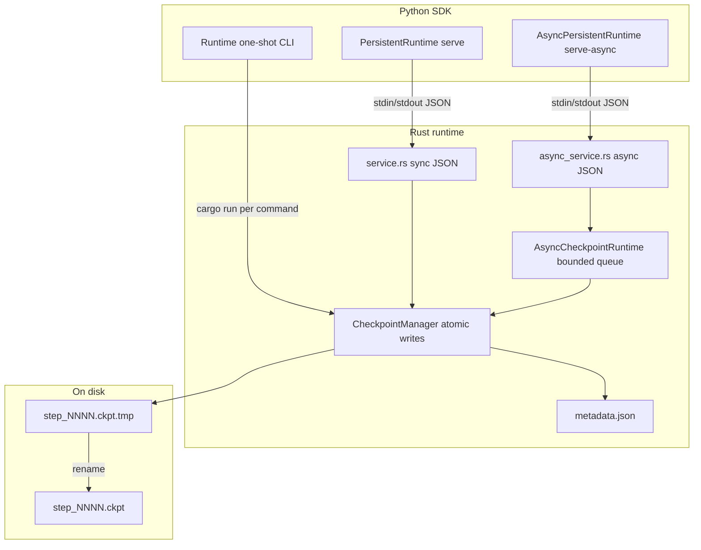

# Faultline

**Fault-tolerant checkpointing for ML training** — a Rust runtime that persists training state safely, with a Python SDK for PyTorch workflows.

Faultline separates *what* gets saved (your model, optimizer, step, metrics) from *how* it is written: atomic files, durable metadata, optional async queuing, and long-lived service processes. The goal is reliable resume after crashes without blocking your training loop on slow storage.

---

## What problem does Faultline solve?

Training jobs fail. GPUs pre-empt, nodes reboot, spot instances vanish, and experiments crash. If checkpoints are slow, inconsistent, or hard to resume from, you lose hours of compute.

Faultline focuses on the **checkpoint write path**:

| Problem | Faultline approach |
|--------|---------------------|
| Partial writes corrupt checkpoints | Atomic save: write temp file → `fsync` → rename |
| “Latest” checkpoint is unclear | `metadata.json` tracks committed steps and paths |
| Saving blocks training on slow disk / S3 | `AsyncCheckpointRuntime` enqueues writes; caller returns after queue accept |
| Spawning `cargo run` per save is expensive | `serve` / `serve-async` persistent JSON services |
| Large payloads don’t fit CLI args | File-based transport (`save_from_file` / temp files) |

Faultline is **not** a full training framework, cluster scheduler, or distributed training system. It is a small, explicit checkpoint layer you can call from Python (today) or other hosts (later).

---

## Architecture



**Repo layout**

| Path | Role |
|------|------|
| `runtime/` | Rust crate: `CheckpointManager`, async queue, CLI, sync/async services |
| `sdk/faultline/` | Python package: `Runtime`, `PersistentRuntime`, `AsyncPersistentRuntime` |
| `sdk/examples/` | Demos: JSON, pickle, PyTorch crash/resume, file transport, async enqueue |
| `sdk/benchmarks/` | Latency comparisons vs `torch.save`, slow-storage simulation |
| `checkpoints/` | Default output dir (gitignored) |

**Service modes**

| Mode | Command | Behavior |
|------|---------|----------|
| One-shot | `cargo run -- save …` | New process per operation |
| Sync service | `cargo run -- serve` | Blocking save; returns after disk commit |
| Async service | `cargo run -- serve-async` | Enqueue via file path; persist in background |

Progress and diagnostics go to **stderr**; **stdout** is reserved for JSON responses in service mode.

---

## Quick start

### Requirements

- **Rust** (stable) — `cargo` in `PATH`
- **Python 3.10+**
- Optional: **PyTorch** for the resume demo and benchmarks

```bash
# Example: conda env (adjust to your setup)
conda create -n faultline python=3.11 -y
conda activate faultline
pip install torch   # optional, for demos/benchmarks
```

### Rust CLI (from `runtime/`)

```bash
cd runtime
cargo run -- save 1 --data "hello"
cargo run -- list
cargo run -- latest
cargo run -- load-latest
```

### Python SDK

```bash
# From repo root; SDK resolves runtime/ relative to the repo
export PYTHONPATH=sdk   # or: pip install -e sdk when packaged

python sdk/examples/basic_usage.py
```

```python
from faultline import PersistentRuntime

with PersistentRuntime(runtime_dir="runtime") as runtime:
    runtime.save_json_checkpoint(1, {"step": 1, "loss": 0.42})
    print(runtime.load_latest_json())
```

See **[sdk/README.md](sdk/README.md)** for API details (JSON, pickle, file transport, `write_delay_ms`).

---

## Crash / resume demo (PyTorch)

A minimal training loop saves `model.state_dict()`, `optimizer.state_dict()`, `step`, and `loss` every 5 steps, then **simulates a crash at step 12**.

**First run** — train until crash:

```bash
conda activate faultline
python sdk/examples/pytorch_resume_demo.py
```

**Second run** — resume from the latest committed checkpoint:

```bash
python sdk/examples/pytorch_resume_demo.py --resume
```

After resume, training continues from the last saved step (typically step 10’s checkpoint) without re-hitting the simulated crash.

---

## Benchmarks

Results are written under `benchmarks/output/` (gitignored).

### Four-way save comparison (local disk, ~1 MB payload)

```bash
python sdk/benchmarks/checkpoint_benchmark.py
```

Compares `torch.save`, one-shot `Runtime`, `PersistentRuntime` JSON/base64, and file transport. On fast local SSD, `torch.save` wins — Faultline adds process and protocol overhead. Large payloads skip CLI-limited paths.

### Async vs sync enqueue (caller stall)

```bash
python sdk/benchmarks/async_checkpoint_benchmark.py
```

Measures **how long the caller waits**, not total persistence time. Async enqueue returns after queue accept; commits finish in the background.

### Slow storage simulation (the main story)

```bash
python sdk/benchmarks/slow_storage_benchmark.py
```

Uses `write_delay_ms=500` to mimic network/object storage latency.

**Example results** (representative local run, 5 saves):

| Metric | Average |
|--------|---------|
| Sync file save (caller blocks) | ~526 ms |
| Async enqueue (caller returns) | ~24 ms |
| Async time-to-commit | ~1525 ms |

**Takeaway:** On slow storage, sync save blocks training for the full write latency; async enqueue lets the loop continue while a background writer drains the queue. Total bytes written are similar — the win is **decoupling**, not magic faster disks.

Enable delay in code or CLI:

```python
PersistentRuntime(runtime_dir="runtime", write_delay_ms=500)
AsyncPersistentRuntime(runtime_dir="runtime", write_delay_ms=500)
```

```bash
cargo run -- serve --write-delay-ms 500
cargo run -- serve-async --write-delay-ms 500
```

---

## Examples

| Script | Shows |
|--------|--------|
| `sdk/examples/basic_usage.py` | JSON checkpoints via one-shot `Runtime` |
| `sdk/examples/pickle_usage.py` | Pickle save/load |
| `sdk/examples/persistent_usage.py` | `PersistentRuntime` / `serve` |
| `sdk/examples/file_transport_usage.py` | Large payload via temp file + `save_from_file` |
| `sdk/examples/async_enqueue_usage.py` | Fast enqueue, poll status, metrics |
| `sdk/examples/pytorch_resume_demo.py` | Crash and resume |
| `sdk/examples/worker_simulation.py` | Multi-worker async enqueue, crash, resume |

### Worker simulation demo (Version 7.0)

Simulates **3 workers** sharing one `AsyncPersistentRuntime`. Each worker runs 20 training steps and enqueues a checkpoint every 5 steps. Worker 1 **crashes at step 12**, then **resumes** from its last committed checkpoint (step 10).

Workers avoid step collisions by encoding a global step: `worker_id * 1_000_000 + local_step`.

```bash
python sdk/examples/worker_simulation.py
```

This demonstrates coordination only — not real distributed training (no ranks, no collective comms, no remote store).

Checkpoints are **worker-aware in metadata** (`worker_id`, `local_step` in `metadata.json`) while filenames still use a encoded global step. Resume uses `latest_checkpoint_for_worker` on the async service instead of parsing metadata by hand.

**Worker-aware retention** (`prune_per_worker`) keeps the latest N checkpoints per worker by `local_step`, so one worker’s newer global step does not delete another worker’s recovery point. Legacy checkpoints without `worker_id` are left unchanged.

### gRPC transport (Version 8.0+)

Optional gRPC service alongside JSON stdin/stdout:

```bash
cd runtime && cargo run -- serve-grpc --addr 127.0.0.1:50051
python sdk/examples/grpc_worker_usage.py
```

For production-style launches (no `cargo run` compile overhead):

```bash
cd runtime
cargo build --release
target/release/runtime.exe serve-grpc --addr 127.0.0.1:50051
```

Python: `GrpcAsyncRuntime` — same async enqueue helpers over gRPC. Pass `runtime_dir` for `cargo run`, or `binary_path` for a release binary. Existing `serve`, `serve-async`, and subprocess SDK paths are unchanged.

```bash
python sdk/benchmarks/grpc_checkpoint_benchmark.py
```

---

## Tests

```bash
cd runtime && cargo test
python -m unittest discover sdk/tests
```

---

## Limitations (current)

These are intentional boundaries for the prototype — not bugs to “fix” in passing.

- **Subprocess + JSON transport** — Python talks to Rust via `cargo run` and newline-delimited JSON, not gRPC or in-process bindings. Simple and debuggable; not lowest latency.
- **Single machine** — No distributed training, multi-rank coordination, or shared remote store (S3, NFS) built in. Checkpoints land in a local `checkpoints/` directory.
- **Pickle for ML state** — Convenient for demos; not a stable cross-language format. Do not load pickles from untrusted sources.
- **No versioning / migration** — Checkpoint blob format is opaque bytes; no schema registry.
- **Async is queue + thread pool** — Not a full I/O scheduler; backpressure is a fixed queue size (`try_enqueue` returns `queued: false` when full).
- **Temp files on enqueue** — Python still pickles to a temp file before Rust reads the path (realistic boundary, extra I/O).
- **`write_delay_ms`** — Sleep before save; models latency, not bandwidth.
- **Windows CLI limits** — Very large inline `--data` payloads hit OS command-line caps; use file transport.

---

## Roadmap

| Direction | Status |
|-----------|--------|
| Atomic checkpoint + metadata | Done |
| Python SDK (sync + persistent service) | Done |
| File transport for large payloads | Done |
| Async service + `AsyncPersistentRuntime` | Done |
| Simulated slow storage for benchmarks | Done |
| gRPC (or similar) transport | Planned |
| PyO3 / in-process Rust API | Planned |
| Remote backends (S3, etc.) | Planned |
| Checkpoint format versioning | Planned |
| Distributed / multi-rank checkpointing | Out of scope for now |

---

## License

Add your license here if publishing the repo.

---

## Contributing

Issues and PRs welcome. Run `cargo test` and `python -m unittest discover sdk/tests` before submitting.
