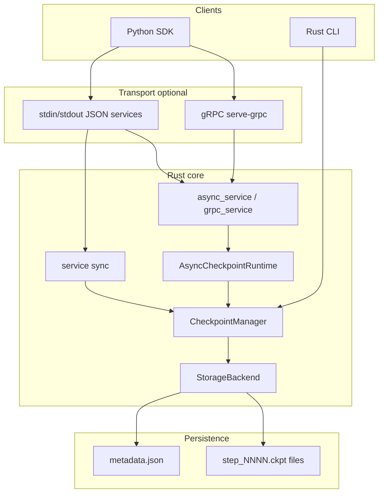

# Faultline architecture

Faultline is a **single-machine checkpoint orchestration runtime**: Python (or CLI) submits checkpoint jobs; Rust persists bytes and updates durable metadata. This document describes how the pieces fit together without walking every file.

---

## Layered view



---

## Python SDK layers

| Class | Transport | When to use |
|-------|-----------|-------------|
| `Runtime` | `cargo run` per command | Scripts, tests, simplest path |
| `PersistentRuntime` | `serve` (sync JSON) | Blocking save; returns after disk commit |
| `AsyncPersistentRuntime` | `serve-async` (JSON) | Fast enqueue; background persistence |
| `GrpcAsyncRuntime` | `serve-grpc` (protobuf) | Same async semantics over gRPC |

Shared helpers in `faultline/runtime.py`:

- Pickle/JSON wrappers around checkpoint bytes
- File transport (`save_from_file`, temp files) for large payloads
- Worker-aware steps: `global_step = worker_id * 1_000_000 + local_step`
- `write_delay_ms` forwarded to Rust for slow-storage benchmarks

The SDK does **not** embed Rust. It spawns the `runtime` binary (or a release build) as a subprocess, except gRPC which uses a long-lived server process.

---

## Transport: JSON services vs gRPC

### JSON (`serve` / `serve-async`)

- One JSON object per line on stdin; one response line on stdout
- Progress and diagnostics on **stderr** (so stdout stays machine-readable)
- Commands: `save_from_file`, `enqueue_from_file`, `enqueue_worker_from_file`, `status`, `metrics`, `latest_for_worker`, `prune_per_worker`, `shutdown`, etc.

### gRPC (`serve-grpc`)

- Optional path alongside JSON (nothing removed)
- Unary RPCs: file path enqueue, inline bytes, client-streaming chunks
- Same underlying `AsyncCheckpointRuntime` and `CheckpointManager` as async JSON
- Python stubs under `sdk/faultline/grpc/`

---

## AsyncCheckpointRuntime

- Bounded in-memory queue of checkpoint jobs
- Background worker thread(s) call `CheckpointManager` to commit each job
- Per-step status: `Queued` → `Writing` → `Committed` (or `Failed` / `Dropped`)
- Metrics: enqueued, committed, failed, dropped, bytes written, write time
- `shutdown` drains the queue then stops the service

Sync `serve` skips the queue: each save blocks until `CheckpointManager` finishes.

---

## CheckpointManager

Orchestrates **logical** checkpoints:

1. Write blob via `StorageBackend::write_atomic` (temp → fsync → rename on local disk)
2. Update `metadata.json` via `StorageBackend::write_metadata`

Public API (unchanged across storage backends):

- `save_checkpoint` / `save_worker_checkpoint`
- `load_latest` / `load_latest_for_worker`
- `latest_checkpoint` / `latest_checkpoint_for_worker`
- `list_checkpoints`, `prune_checkpoints`, `prune_checkpoints_per_worker`

Optional `write_delay_ms` sleeps before each blob write (benchmark hook for slow storage).

Constructors:

- `new` / `new_with_delay` → `LocalStorageBackend` under `checkpoints/`
- `with_storage(Arc<dyn StorageBackend>, …)` → tests or custom backends

---

## StorageBackend

Trait abstracting blob + metadata I/O:

| Method | Role |
|--------|------|
| `write_atomic` | Persist one checkpoint file; returns metadata path string |
| `read` / `delete` / `exists` | Blob access by metadata path |
| `read_metadata` / `write_metadata` / `metadata_exists` | `metadata.json` lifecycle |

Implementations:

| Backend | Purpose |
|---------|---------|
| `LocalStorageBackend` | Production default: repo `checkpoints/` directory |
| `InMemoryStorageBackend` | Unit tests, failure simulation harness |
| `FailureInjectingStorageBackend<B>` | One-shot injected errors on wrapped backend |

Future: S3-compatible remote backend behind the same trait (not implemented yet).

---

## Metadata lifecycle

`metadata.json` is the **source of truth** for what is committed.

Each entry records:

- `step` (global step; worker jobs use encoded global step)
- `path` (e.g. `checkpoints/step_0001.ckpt`)
- `status` (`committed`)
- Optional `worker_id`, `local_step` for multi-worker demos

**Latest checkpoint** = entry matching `latest_step` in metadata, not “newest file on disk.”

### Failure semantics (important)

Persistence is two phases:

1. **Blob write** (`write_atomic`)
2. **Metadata commit** (`write_metadata` after updating in-memory structure)

If phase 1 succeeds and phase 2 fails, an **orphan blob** may exist that is **not** listed in metadata and will not be returned by `load_latest`.

If phase 1 fails, metadata is not updated for that step.

The `failure-demo` CLI (`cargo run -- failure-demo`) demonstrates this with `FailureInjectingStorageBackend` over in-memory storage.

---

## On-disk layout (local backend)

```
checkpoints/
  metadata.json
  step_0001.ckpt
  step_0002.ckpt
  step_0001.ckpt.tmp   # only during in-flight write
```

Worker-aware filenames still use global step in the name; worker identity lives in metadata.

---

## Repo map

| Path | Role |
|------|------|
| `runtime/` | Rust crate: manager, async runtime, services, gRPC, storage |
| `proto/` | gRPC definitions |
| `sdk/faultline/` | Python package |
| `sdk/examples/` | Demos |
| `sdk/benchmarks/` | Benchmark scripts |
| `docs/` | Architecture, runbook, roadmap |
| `checkpoints/` | Default output (gitignored) |

See also: [RUNBOOK.md](RUNBOOK.md), [ROADMAP.md](ROADMAP.md).
